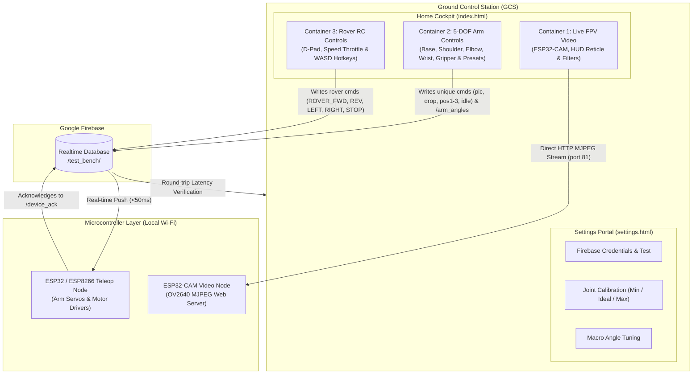

# Cyber-Rover & 5-DOF Robotic Arm Teleoperation Cockpit
### Firebase Realtime Database & ESP32-CAM Ground Control Station (GCS)

A futuristic, high-performance teleoperation cockpit inspired by drone FPV ground control stations. Features live wireless video streaming with tactical HUD overlays, 5-DOF robotic manipulator articulation with calibrated servo ranges, preset macro actions, and full RC rover vehicle controls with keyboard gaming ergonomics.

---

## Architecture Overview



---

## Directory Structure

```
.
├── web-dashboard/
│   ├── index.html        # Futuristic Drone Teleoperation Cockpit (3 Containers)
│   ├── settings.html     # Dedicated Hardware Calibration & Firebase Settings Page
│   ├── config.js         # Centralized configuration & localStorage manager
│   ├── soundFx.js        # Web Audio API synthetic gaming SFX manager
│   ├── app.js            # Cockpit live stream, arm sliders & rover drive logic
│   ├── settings.js       # Calibration sliders, Firebase tester & settings logic
│   └── style.css         # Glassmorphism, cyber HUD aesthetics & responsive styling
├── firmware/
│   ├── esp_firebase_listener/
│   │   └── esp_firebase_listener.ino   # ESP32/ESP8266 RTDB Stream Node (Arm + Rover)
│   └── esp32_cam_streamer/
│       └── esp32_cam_streamer.ino      # AI-Thinker ESP32-CAM MJPEG Streamer
└── README.md
```
```

---

## 1. Firebase Setup & Database Rules

### Step 1: Create a Firebase Project
1. Go to the [Firebase Console](https://console.firebase.google.com/).
2. Click **Add project**, enter a project name (e.g., `esp-iot-testbench`), and proceed without Google Analytics for testing.

### Step 2: Create Realtime Database
1. In the left navigation menu, click **Build** -> **Realtime Database**.
2. Click **Create Database**.
3. Select your preferred database location (e.g., `United States` or closest to your location).
4. When prompted for Security Rules, select **Start in test mode**.

### Step 3: Configure Database Rules for Test-Bench
In the Realtime Database tab, navigate to the **Rules** tab at the top. Replace the content with:

```json
{
  "rules": {
    ".read": true,
    ".write": true
  }
}
```
> [!IMPORTANT]
> These rules allow unrestricted read/write access for initial hardware testing without requiring auth tokens. Before deploying to production, secure with Firebase Authentication rules.

Click **Publish**.

### Step 4: Copy Your Credentials
1. **Database URL:** Copy the URL at the top of your Realtime Database Data tab:
   `https://<your-project-id>-default-rtdb.firebaseio.com`
2. **Web API Key & Project ID:** 
   - Click the gear icon (⚙️) next to *Project Overview* -> **Project settings**.
   - Under the *General* tab, copy your **Project ID** and **Web API Key**.

---

## 2. Running the Web Dashboard

The web dashboard is built using standard HTML5, CSS3, and ES Modules with Firebase Modular SDK (v10). No build step (`npm build`) is required!

### Option A: Local Dev Server (Recommended)
Because modern browsers restrict certain features on `file:///`, serve the dashboard using any local HTTP server:

```powershell
# Using Python
cd web-dashboard
python -m http.server 3000
```
or
```powershell
# Using Node / npx
npx -y serve web-dashboard
```
Open your browser to `http://localhost:3000`.

### Option B: Direct Double-Click
You can double-click `web-dashboard/index.html` to open it directly in Google Chrome, Edge, or Firefox.

> [!WARNING]
> **Browser Mixed-Content Warning**: Modern browsers block insecure `http://` MJPEG video streams if the web dashboard is hosted on an `https://` domain (such as GitHub Pages or Firebase Hosting with SSL). Opening the dashboard via `http://localhost:3000` or `file:///` completely avoids this restriction and allows live local video streaming.

---

## 3. Microcontroller Test Firmware: ESP Firebase Listener

### Target Hardware
- **ESP32** (NodeMCU-32S, ESP-WROOM-32, DOIT DevKit) **OR**
- **ESP8266** (NodeMCU v2/v3, Wemos D1 Mini)

### Required Arduino Libraries
1. Open **Arduino IDE**.
2. Go to **Sketch** -> **Include Library** -> **Manage Libraries...**
3. In the search bar, type:
   ```text
   Firebase Arduino Client Library for ESP8266 and ESP32
   ```
   *(Author: Mobizt)*
4. Click **Install** (and install dependencies if prompted).

### Configuration & Flashing
1. Open [`esp_firebase_listener.ino`](file:///firmware/esp_firebase_listener/esp_firebase_listener.ino).
2. Update lines 32–40 with your credentials:
   ```cpp
   #define WIFI_SSID       "YOUR_WIFI_SSID"
   #define WIFI_PASSWORD   "YOUR_WIFI_PASSWORD"
   #define API_KEY         "YOUR_FIREBASE_WEB_API_KEY"
   #define DATABASE_URL    "https://YOUR-PROJECT-ID-default-rtdb.firebaseio.com"
   ```
3. Connect your ESP board via USB.
4. Select your board from **Tools** -> **Board** (e.g., *ESP32 Dev Module* or *NodeMCU 1.0 (ESP-12E Module)*).
5. Select the correct COM port under **Tools** -> **Port**.
6. Click **Upload**.
7. Open **Serial Monitor** at **115200 baud**.

---

## 4. ESP32-CAM Video Streamer Firmware

### Target Hardware
- **AI-Thinker ESP32-CAM** (with OV2640 camera module)

### FTDI / USB-UART Programmer Wiring
The AI-Thinker ESP32-CAM lacks a built-in USB port. Connect it to an FTDI / USB-to-UART programmer as follows:

| FTDI Programmer Pin | ESP32-CAM Pin | Note |
|---------------------|---------------|------|
| **VCC (5V)** | **5V** | **Crucial:** Always use 5V pin, not 3.3V (avoids brownout crashes) |
| **GND** | **GND** | Common ground |
| **TX** | **U0R (GPIO 3)** | Cross TX to RX |
| **RX** | **U0T (GPIO 1)** | Cross RX to TX |
| — | **GPIO 0 to GND** | **Bridge with jumper for Flashing Mode** |

### Arduino IDE Board Settings
1. Go to **Tools** -> **Board** -> **ESP32 Arduino** -> select **AI Thinker ESP32-CAM**.
2. Set the following settings:
   - **CPU Frequency:** `240MHz (WiFi/BT)`
   - **Flash Frequency:** `80MHz`
   - **Flash Mode:** `QIO`
   - **Partition Scheme:** `Huge APP (3MB No OTA/1MB SPIFFS)` *(Mandatory to fit camera drivers!)*
   - **Upload Speed:** `115200`
3. Open [`esp32_cam_streamer.ino`](file:///firmware/esp32_cam_streamer/esp32_cam_streamer.ino).
4. Update lines 23–24 with your Wi-Fi credentials:
   ```cpp
   const char* ssid     = "YOUR_WIFI_SSID";
   const char* password = "YOUR_WIFI_PASSWORD";
   ```
5. Ensure **GPIO 0 is bridged to GND**.
6. Press the **RST** button on the bottom of the ESP32-CAM board.
7. Click **Upload** in Arduino IDE.
8. Once you see `Leaving... Hard resetting via RTS pin...`:
   - **Disconnect the GPIO 0 jumper from GND**.
   - Press the **RST** button to reboot into normal Run mode.
9. Open **Serial Monitor** at **115200 baud** to see the assigned stream URL:
   ```text
   Camera Ready!
   STREAM URL: http://192.168.1.150:81/stream
   ```

---

## 5. End-to-End Verification Checklist

| Step | Action | Expected Result | Verified? |
|---|---|---|:---:|
| **1** | Enter Firebase credentials in dashboard & click **Connect & Sync** | Green "Firebase Sync Active" badge appears; initial ping logged in Console | [ ] |
| **2** | Click **Motor Forward** button | Serial Monitor on ESP Node immediately logs:<br/>`[COMMAND RECEIVED]: Motor Forward` | [ ] |
| **3** | Move **Servo Angle Slider** to `135°` | Serial Monitor logs:<br/>`[SERVO CONTROLLER] Target Angle Set to: 135 degrees` | [ ] |
| **4** | Check Web Dashboard **Round-Trip Feedback** | "Echoed Command", "Echoed Servo Angle", and "Node Ack" reflect changes in < 150ms | [ ] |
| **5** | Enter ESP32-CAM IP & Port in dashboard, click **Connect Stream** | MJPEG video feed displays live in video player with active FPS counter | [ ] |
| **6** | Click **Snapshot** button | Frame captures and downloads as timestamped `.jpg` image | [ ] |
